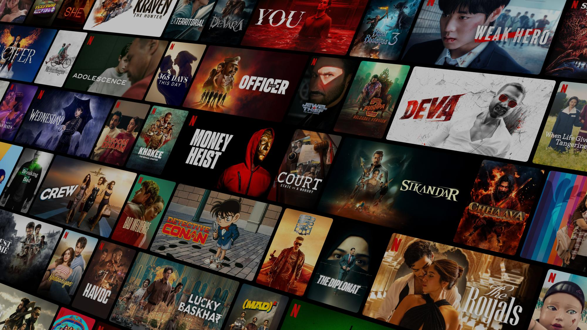

# 🎬 Neftlix Clone

A clean and responsive Neftlix landing page clone built using just **HTML** and **CSS** — no frameworks, no JavaScript.

> 🌐 **Live Demo:**  
> [https://shadabalam117.github.io/Neftlix-clone/](https://shadabalam117.github.io/Neftlix-clone/)

---

## 📸 Screenshots

  
<!-- You can add more screenshots by uploading them and linking here -->

---

## ✅ Features

- 📱 Fully responsive for mobile, tablet, and desktop
- 🔥 Modern Neftlix-style layout
- 🎞️ Horizontal scrollable trending section
- 🎯 Pure HTML and CSS — no external libraries or JS
- 📂 Organized structure for easy editing

---

## 🛠️ Built With

- HTML5  
- CSS3  
- Flexbox  
- Grid  
- Media Queries  

---

## 📁 Project Structure

```

Neftlix-clone/
├── index.html
├── style.css
└── images/
├── bg.jpg
├── logo.svg
├── movie1.webp
└── ...

````

---

## 🚀 Getting Started

To run this project locally:

```bash
git clone https://github.com/shadabalam117/Neftlix-clone.git
cd Neftlix-clone
open index.html  # or double-click index.html
````

---

## ✍️ Author

**Shadab Alam**
🔗 [GitHub Profile](https://github.com/shadabalam117)

---

## 📜 License

This project is open source and free to use for personal and educational purposes.

---

## 🙌 Special Thanks

* Inspired by Neftlix's official landing page.
* Fonts via [Google Fonts](https://fonts.google.com/).

````
